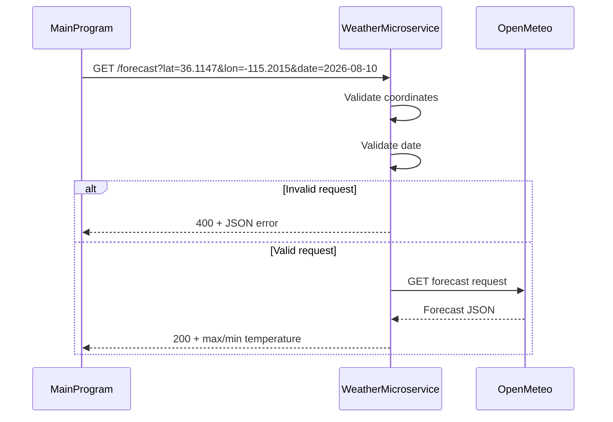

# Weather Forecast Microservice

## Description

The Weather Forecast Microservice provides daily weather forecasts for a specified
location and date using the Open-Meteo API.

The service accepts a latitude, longitude, and date, retrieves the forecast from
Open-Meteo, and returns the maximum and minimum temperatures in Fahrenheit.

### Work Split

**Emmanuel Vazquez**
- Flask application setup
- Open-Meteo API integration
- Successful forecast response

**Eitan Gor**
- Request validation
- Structured JSON error handling
- Edge-case handling
- Validation tests
- README and communication contract
- UML sequence diagram

---

# Running the Microservice

## Install dependencies

```bash
pip install -r requirements.txt
```

## Start the service

```bash
python app.py
```

The Weather Forecast Microservice runs on:

```
http://127.0.0.1:8002
```

---

# Communication Contract

The Main Program communicates with the Weather Forecast Microservice through HTTP
requests and JSON responses.

The Main Program does **not** import or directly call any Weather Microservice
functions.

---

# Requesting Data

Send an HTTP GET request to:

```
GET /forecast
```

Required query parameters:

| Parameter | Description | Example |
|-----------|-------------|---------|
| lat | Latitude | 36.1147 |
| lon | Longitude | -115.2015 |
| date | Forecast date (YYYY-MM-DD) | 2026-08-10 |

Example request:

```
GET /forecast?lat=36.1147&lon=-115.2015&date=2026-08-10
```

Python example:

```python
import requests

response = requests.get(
    "http://127.0.0.1:8002/forecast",
    params={
        "lat": 36.1147,
        "lon": -115.2015,
        "date": "2026-08-10",
    },
)

forecast = response.json()
```

---

# Receiving Data

If the request succeeds, the service returns:

Status:

```
200 OK
```

Example response:

```json
{
    "temp_max_f": 92.3,
    "temp_min_f": 71.6
}
```

---

# Error Responses

If the request cannot be processed, the service returns structured JSON errors.

### Missing coordinates

Status:

```
400 Bad Request
```

```json
{
    "error": "invalid_coordinates",
    "message": "Parameters 'lat' and 'lon' are required."
}
```

### Invalid coordinates

```json
{
    "error": "invalid_coordinates",
    "message": "Parameters 'lat' and 'lon' must be numeric."
}
```

### Invalid date

```json
{
    "error": "invalid_date",
    "message": "Parameter 'date' must use YYYY-MM-DD format."
}
```

### Unsupported forecast date

```json
{
    "error": "unsupported_date",
    "message": "The requested date is outside the supported forecast range."
}
```

### Weather provider unavailable

Status:

```
502 Bad Gateway
```

```json
{
    "error": "weather_provider_unavailable",
    "message": "The weather provider could not be reached."
}
```

---

# UML Sequence Diagram



---

# Running Tests

Run all tests:

```bash
pytest
```

Or run only the validation tests:

```bash
pytest test_validation.py
```

---

# External Dependency

Weather forecasts are provided by the Open-Meteo Forecast API:

https://open-meteo.com/

The microservice acts as a wrapper around the API by validating requests,
returning a simplified response format, and providing consistent JSON error
messages for client applications.
